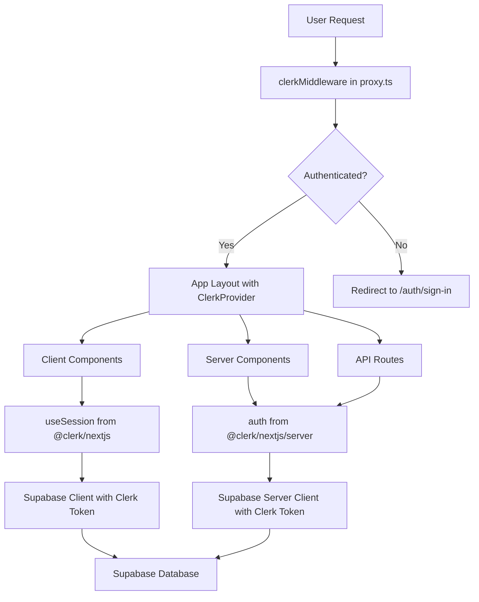

# Clerk Authentication Integration Plan

## Overview

Migrate from Supabase authentication to Clerk authentication while maintaining Supabase for database operations. This involves updating middleware, layout, authentication pages, client/server components, API routes, and services.

## Architecture Changes



## Implementation Steps

### 1. Install Clerk Package

- Add `@clerk/nextjs@latest` to `package.json` dependencies
- Run `pnpm install`

### 2. Configure Clerk for Supabase Integration

**Prerequisites** (to be done in Clerk Dashboard):

- Visit Clerk's [Connect with Supabase page](https://clerk.com/docs/integrations/databases/supabase) to configure Clerk instance for Supabase compatibility
- Add a new Third-Party Auth integration with Clerk in the Supabase dashboard
- For local development: Add config to `supabase/config.toml`:
  ```toml
  [auth.third_party.clerk]
  enabled = true
  domain = "your-clerk-domain.clerk.accounts.dev"
  ```


### 3. Update Supabase Client Libraries

**Critical**: Configure Supabase clients to use Clerk session tokens per [Supabase's official Clerk integration guide](https://supabase.com/docs/guides/auth/third-party/clerk).

- **`src/lib/services/supabase/client.ts`**: Update client-side Supabase client
  - Accept Clerk session as parameter or create a hook that uses `useSession()` from `@clerk/nextjs`
  - Pass `accessToken: async () => session?.getToken() ?? null` to Supabase `createBrowserClient()`
  - Pattern: `accessToken: async () => session?.getToken() ?? null`

- **`src/lib/services/supabase/server.ts`**: Update server-side Supabase client
  - Use `auth()` from `@clerk/nextjs/server` to get Clerk auth object
  - Pass `accessToken: async () => (await auth()).getToken() ?? null` to Supabase `createServerClient()`
  - This allows server-side Supabase operations to use Clerk authentication

### 4. Update Middleware (`src/proxy.ts`)

- Replace Supabase `updateSession` with Clerk's `clerkMiddleware()`
- Update matcher config to match Clerk's recommended pattern
- Remove Supabase auth redirect logic (Clerk handles this)

### 5. Update Root Layout (`src/app/layout.tsx`)

- Wrap application with `<ClerkProvider>` from `@clerk/nextjs`
- Keep existing UI components (CustomCursor, SakuraBackground)
- Maintain current styling and structure

### 6. Replace Authentication Pages

- **`src/app/auth/sign-in/page.tsx`**: Replace custom Supabase form with Clerk's `<SignIn />` component or use Clerk's hosted sign-in
- **`src/app/auth/sign-up/page.tsx`**: Replace custom Supabase form with Clerk's `<SignUp />` component or use Clerk's hosted sign-up
- Maintain existing styling and branding where possible

### 7. Update Client-Side Auth Checks

Files to update:

- `src/app/app/page.tsx`: Replace `supabase.auth.getUser()` with `useUser()` from `@clerk/nextjs`
- `src/components/sidebar.tsx`: Replace `supabase.auth.getUser()` with `useUser()`
- `src/lib/contexts/organization-context.tsx`: Replace `supabase.auth.getUser()` with `useUser()`
- `src/lib/hooks/use-is-org-owner.ts`: Replace `supabase.auth.getUser()` with `useUser()`
- `src/lib/services/user.service.ts`: Replace `supabase.auth.getUser()` and `supabase.auth.getSession()` with Clerk equivalents
- `src/components/client-details-panel.tsx`: Replace `supabase.auth.getUser()` with `useUser()`
- `src/app/onboarding/page.tsx`: Replace Supabase auth calls with Clerk equivalents
- `src/app/select-organization/page.tsx`: Replace `supabase.auth.getUser()` with `useUser()`
- `src/app/set-password/page.tsx`: Replace Supabase auth calls with Clerk equivalents

### 8. Update Server-Side Auth Checks

Files to update:

- `src/app/api/users/route.ts`: Replace Supabase token verification with `auth()` from `@clerk/nextjs/server`
- `src/app/api/users/[userId]/route.ts`: Replace Supabase token verification with `auth()`
- `src/app/api/organizations/route.ts`: Replace Supabase token verification with `auth()`
- `src/app/api/check-user/route.ts`: Replace Supabase admin auth with Clerk user lookup
- `src/app/api/set-password/route.ts`: Replace Supabase admin auth with Clerk user management
- `src/lib/services/organization.service.ts`: Replace server-side Supabase auth with Clerk `auth()`

### 9. Update Logout Functionality

- Replace `supabase.auth.signOut()` with Clerk's `useClerk().signOut()` or `signOut()` from `@clerk/nextjs`
- Update all logout handlers across components

### 10. Environment Variables

- Add Clerk environment variables to `.env.local` (not tracked):
  - `NEXT_PUBLIC_CLERK_PUBLISHABLE_KEY=YOUR_PUBLISHABLE_KEY`
  - `CLERK_SECRET_KEY=YOUR_SECRET_KEY`
- Document these in comments or README (using placeholders only)

### 11. Database Schema Update

**Note**: Since all Supabase users have been deleted, we can directly use Clerk user IDs in the database schema. Any foreign key references to `auth.users(id)` should be updated to reference Clerk user IDs directly. The database schema may need to be updated to use Clerk user IDs as the primary identifier for users in tables like `user_profiles` and `user_organization_memberships`.

## Key Files to Modify

### Core Auth Files

- `src/lib/services/supabase/client.ts` - Update to use Clerk session token
- `src/lib/services/supabase/server.ts` - Update to use Clerk session token
- `src/proxy.ts` - Replace with `clerkMiddleware()`
- `src/app/layout.tsx` - Add `<ClerkProvider>`
- `src/app/auth/sign-in/page.tsx` - Use Clerk SignIn component
- `src/app/auth/sign-up/page.tsx` - Use Clerk SignUp component

### Client Components (use `useUser()` from `@clerk/nextjs`)

- `src/app/app/page.tsx`
- `src/components/sidebar.tsx`
- `src/lib/contexts/organization-context.tsx`
- `src/lib/hooks/use-is-org-owner.ts`
- `src/components/client-details-panel.tsx`
- `src/app/onboarding/page.tsx`
- `src/app/select-organization/page.tsx`
- `src/app/set-password/page.tsx`

### Server Components & API Routes (use `auth()` from `@clerk/nextjs/server`)

- `src/app/api/users/route.ts`
- `src/app/api/users/[userId]/route.ts`
- `src/app/api/organizations/route.ts`
- `src/app/api/check-user/route.ts`
- `src/app/api/set-password/route.ts`
- `src/lib/services/organization.service.ts`
- `src/lib/services/user.service.ts`

## Migration Pattern

### Supabase Client Integration

**Client-Side Supabase Client** (per [Supabase docs](https://supabase.com/docs/guides/auth/third-party/clerk)):

```typescript
// src/lib/services/supabase/client.ts
import { createBrowserClient } from '@supabase/ssr';
import { useSession } from '@clerk/nextjs';

// Option 1: Create a hook that returns Supabase client with Clerk session
export function useSupabaseClient() {
  const { session } = useSession();
  
  return createBrowserClient(
    process.env.NEXT_PUBLIC_SUPABASE_URL!,
    process.env.NEXT_PUBLIC_SUPABASE_PUBLISHABLE_KEY!,
    {
      accessToken: async () => (await session?.getToken()) ?? null,
    }
  );
}

// Option 2: Create client factory that accepts session
export function createClient(session: ReturnType<typeof useSession>['session']) {
  return createBrowserClient(
    process.env.NEXT_PUBLIC_SUPABASE_URL!,
    process.env.NEXT_PUBLIC_SUPABASE_PUBLISHABLE_KEY!,
    {
      accessToken: async () => (await session?.getToken()) ?? null,
    }
  );
}
```

**Note**: The exact implementation pattern depends on how components currently use the Supabase client. We may need to refactor components to use the hook pattern or pass session as a parameter.

**Server-Side Supabase Client** (per [Supabase docs](https://supabase.com/docs/guides/auth/third-party/clerk)):

```typescript
// src/lib/services/supabase/server.ts
import { createServerClient } from '@supabase/ssr';
import { auth } from '@clerk/nextjs/server';
import { cookies } from 'next/headers';

export async function createClient() {
  const cookieStore = await cookies();
  const clerkAuth = await auth();

  return createServerClient(
    process.env.NEXT_PUBLIC_SUPABASE_URL!,
    process.env.NEXT_PUBLIC_SUPABASE_PUBLISHABLE_KEY!,
    {
      cookies: {
        getAll() {
          return cookieStore.getAll();
        },
        setAll(cookiesToSet) {
          try {
            cookiesToSet.forEach(({ name, value, options }) => 
              cookieStore.set(name, value, options)
            );
          } catch {
            // Ignore if called from Server Component
          }
        },
      },
      accessToken: async () => (await clerkAuth.getToken()) ?? null,
    }
  );
}
```

### Client-Side Auth Pattern

```typescript
// Before (Supabase)
const { data: { user } } = await supabase.auth.getUser();

// After (Clerk)
import { useUser } from '@clerk/nextjs';
const { user } = useUser();
```

### Server-Side Auth Pattern

```typescript
// Before (Supabase)
const { data: { user } } = await supabase.auth.getUser(token);

// After (Clerk)
import { auth } from '@clerk/nextjs/server';
const { userId } = await auth();
```

## Database Schema and RLS Policy Updates

### Step 1: Update Schema to Use Text for User IDs

Clerk user IDs are strings (not UUIDs), so we need to update the schema first:

```sql
-- Update user_organization_memberships table
ALTER TABLE public.user_organization_memberships 
  ALTER COLUMN user_id TYPE text;

-- Remove foreign key constraint to auth.users (no longer exists)
ALTER TABLE public.user_organization_memberships 
  DROP CONSTRAINT IF EXISTS user_organization_memberships_user_id_fkey;

-- Update user_profiles table if it has user_id references
-- (Assuming user_profiles.id is the user_id)
ALTER TABLE public.user_profiles 
  ALTER COLUMN id TYPE text;

-- Update any other tables that reference user_id as UUID
-- Check your schema for other tables that might need updating
```

### Step 2: Update RLS Policies for Clerk

Replace all instances of `auth.uid()` with `auth.jwt()->>'sub'` (Clerk user ID is in the JWT 'sub' claim).

**Important**: Run these queries in order. Each policy is dropped and recreated with the updated Clerk-compatible condition.

```sql
-- ============================================
-- client_activities policies
-- ============================================

-- Drop existing policies
DROP POLICY IF EXISTS "Users can read activities in their organization" ON public.client_activities;
DROP POLICY IF EXISTS "Users can insert activities in their organization" ON public.client_activities;

-- Recreate with Clerk JWT
CREATE POLICY "Users can read activities in their organization" ON public.client_activities
  FOR SELECT
  TO public
  USING (
    organization_id IN (
      SELECT user_organization_memberships.organization_id
      FROM user_organization_memberships
      WHERE user_organization_memberships.user_id = (auth.jwt()->>'sub')
        AND user_organization_memberships.is_active = true
    )
  );

CREATE POLICY "Users can insert activities in their organization" ON public.client_activities
  FOR INSERT
  TO public
  WITH CHECK (
    organization_id IN (
      SELECT user_organization_memberships.organization_id
      FROM user_organization_memberships
      WHERE user_organization_memberships.user_id = (auth.jwt()->>'sub')
        AND user_organization_memberships.is_active = true
    )
  );

-- ============================================
-- clients policies
-- ============================================

DROP POLICY IF EXISTS "Admins can delete clients" ON public.clients;
DROP POLICY IF EXISTS "Users can read clients in their organization" ON public.clients;
DROP POLICY IF EXISTS "Users can insert clients in their organization" ON public.clients;
DROP POLICY IF EXISTS "Users can update clients in their organization" ON public.clients;

CREATE POLICY "Admins can delete clients" ON public.clients
  FOR DELETE
  TO public
  USING (
    organization_id IN (
      SELECT user_organization_memberships.organization_id
      FROM user_organization_memberships
      WHERE user_organization_memberships.user_id = (auth.jwt()->>'sub')
        AND user_organization_memberships.is_active = true
        AND user_organization_memberships.role IN ('owner', 'admin')
    )
  );

CREATE POLICY "Users can read clients in their organization" ON public.clients
  FOR SELECT
  TO public
  USING (
    organization_id IN (
      SELECT user_organization_memberships.organization_id
      FROM user_organization_memberships
      WHERE user_organization_memberships.user_id = (auth.jwt()->>'sub')
        AND user_organization_memberships.is_active = true
    )
  );

CREATE POLICY "Users can insert clients in their organization" ON public.clients
  FOR INSERT
  TO public
  WITH CHECK (
    organization_id IN (
      SELECT user_organization_memberships.organization_id
      FROM user_organization_memberships
      WHERE user_organization_memberships.user_id = (auth.jwt()->>'sub')
        AND user_organization_memberships.is_active = true
    )
  );

CREATE POLICY "Users can update clients in their organization" ON public.clients
  FOR UPDATE
  TO public
  USING (
    organization_id IN (
      SELECT user_organization_memberships.organization_id
      FROM user_organization_memberships
      WHERE user_organization_memberships.user_id = (auth.jwt()->>'sub')
        AND user_organization_memberships.is_active = true
    )
  );

-- ============================================
-- contacts policies
-- ============================================

DROP POLICY IF EXISTS "Users can update contacts in their organization" ON public.contacts;
DROP POLICY IF EXISTS "Users can read contacts in their organization" ON public.contacts;
DROP POLICY IF EXISTS "Users can insert contacts in their organization" ON public.contacts;
DROP POLICY IF EXISTS "Users can delete contacts in their organization" ON public.contacts;

CREATE POLICY "Users can update contacts in their organization" ON public.contacts
  FOR UPDATE
  TO public
  USING (
    organization_id IN (
      SELECT user_organization_memberships.organization_id
      FROM user_organization_memberships
      WHERE user_organization_memberships.user_id = (auth.jwt()->>'sub')
        AND user_organization_memberships.is_active = true
    )
  );

CREATE POLICY "Users can read contacts in their organization" ON public.contacts
  FOR SELECT
  TO public
  USING (
    organization_id IN (
      SELECT user_organization_memberships.organization_id
      FROM user_organization_memberships
      WHERE user_organization_memberships.user_id = (auth.jwt()->>'sub')
        AND user_organization_memberships.is_active = true
    )
  );

CREATE POLICY "Users can insert contacts in their organization" ON public.contacts
  FOR INSERT
  TO public
  WITH CHECK (
    organization_id IN (
      SELECT user_organization_memberships.organization_id
      FROM user_organization_memberships
      WHERE user_organization_memberships.user_id = (auth.jwt()->>'sub')
        AND user_organization_memberships.is_active = true
    )
  );

CREATE POLICY "Users can delete contacts in their organization" ON public.contacts
  FOR DELETE
  TO public
  USING (
    organization_id IN (
      SELECT user_organization_memberships.organization_id
      FROM user_organization_memberships
      WHERE user_organization_memberships.user_id = (auth.jwt()->>'sub')
        AND user_organization_memberships.is_active = true
    )
  );

-- ============================================
-- deal_items policies
-- ============================================

DROP POLICY IF EXISTS "Users can delete deal items in their organization" ON public.deal_items;
DROP POLICY IF EXISTS "Users can insert deal items in their organization" ON public.deal_items;
DROP POLICY IF EXISTS "Users can read deal items in their organization" ON public.deal_items;
DROP POLICY IF EXISTS "Users can update deal items in their organization" ON public.deal_items;

CREATE POLICY "Users can delete deal items in their organization" ON public.deal_items
  FOR DELETE
  TO public
  USING (
    organization_id IN (
      SELECT user_organization_memberships.organization_id
      FROM user_organization_memberships
      WHERE user_organization_memberships.user_id = (auth.jwt()->>'sub')
        AND user_organization_memberships.is_active = true
    )
  );

CREATE POLICY "Users can insert deal items in their organization" ON public.deal_items
  FOR INSERT
  TO public
  WITH CHECK (
    organization_id IN (
      SELECT user_organization_memberships.organization_id
      FROM user_organization_memberships
      WHERE user_organization_memberships.user_id = (auth.jwt()->>'sub')
        AND user_organization_memberships.is_active = true
    )
  );

CREATE POLICY "Users can read deal items in their organization" ON public.deal_items
  FOR SELECT
  TO public
  USING (
    organization_id IN (
      SELECT user_organization_memberships.organization_id
      FROM user_organization_memberships
      WHERE user_organization_memberships.user_id = (auth.jwt()->>'sub')
        AND user_organization_memberships.is_active = true
    )
  );

CREATE POLICY "Users can update deal items in their organization" ON public.deal_items
  FOR UPDATE
  TO public
  USING (
    organization_id IN (
      SELECT user_organization_memberships.organization_id
      FROM user_organization_memberships
      WHERE user_organization_memberships.user_id = (auth.jwt()->>'sub')
        AND user_organization_memberships.is_active = true
    )
  );

-- ============================================
-- deals policies
-- ============================================

DROP POLICY IF EXISTS "Admins can delete deals" ON public.deals;
DROP POLICY IF EXISTS "Users can read deals in their organization" ON public.deals;
DROP POLICY IF EXISTS "Users can insert deals in their organization" ON public.deals;
DROP POLICY IF EXISTS "Users can update deals in their organization" ON public.deals;

CREATE POLICY "Admins can delete deals" ON public.deals
  FOR DELETE
  TO public
  USING (
    organization_id IN (
      SELECT user_organization_memberships.organization_id
      FROM user_organization_memberships
      WHERE user_organization_memberships.user_id = (auth.jwt()->>'sub')
        AND user_organization_memberships.is_active = true
        AND user_organization_memberships.role IN ('owner', 'admin')
    )
  );

CREATE POLICY "Users can read deals in their organization" ON public.deals
  FOR SELECT
  TO public
  USING (
    organization_id IN (
      SELECT user_organization_memberships.organization_id
      FROM user_organization_memberships
      WHERE user_organization_memberships.user_id = (auth.jwt()->>'sub')
        AND user_organization_memberships.is_active = true
    )
  );

CREATE POLICY "Users can insert deals in their organization" ON public.deals
  FOR INSERT
  TO public
  WITH CHECK (
    organization_id IN (
      SELECT user_organization_memberships.organization_id
      FROM user_organization_memberships
      WHERE user_organization_memberships.user_id = (auth.jwt()->>'sub')
        AND user_organization_memberships.is_active = true
    )
  );

CREATE POLICY "Users can update deals in their organization" ON public.deals
  FOR UPDATE
  TO public
  USING (
    organization_id IN (
      SELECT user_organization_memberships.organization_id
      FROM user_organization_memberships
      WHERE user_organization_memberships.user_id = (auth.jwt()->>'sub')
        AND user_organization_memberships.is_active = true
    )
  );

-- ============================================
-- organization_settings policies
-- ============================================

DROP POLICY IF EXISTS "Admins can manage organization settings" ON public.organization_settings;
DROP POLICY IF EXISTS "Users can read settings in their organization" ON public.organization_settings;

CREATE POLICY "Admins can manage organization settings" ON public.organization_settings
  FOR ALL
  TO public
  USING (
    organization_id IN (
      SELECT user_organization_memberships.organization_id
      FROM user_organization_memberships
      WHERE user_organization_memberships.user_id = (auth.jwt()->>'sub')
        AND user_organization_memberships.is_active = true
        AND user_organization_memberships.role IN ('owner', 'admin')
    )
  )
  WITH CHECK (
    organization_id IN (
      SELECT user_organization_memberships.organization_id
      FROM user_organization_memberships
      WHERE user_organization_memberships.user_id = (auth.jwt()->>'sub')
        AND user_organization_memberships.is_active = true
        AND user_organization_memberships.role IN ('owner', 'admin')
    )
  );

CREATE POLICY "Users can read settings in their organization" ON public.organization_settings
  FOR SELECT
  TO public
  USING (
    organization_id IN (
      SELECT user_organization_memberships.organization_id
      FROM user_organization_memberships
      WHERE user_organization_memberships.user_id = (auth.jwt()->>'sub')
        AND user_organization_memberships.is_active = true
    )
  );

-- ============================================
-- organizations policies
-- ============================================

DROP POLICY IF EXISTS "Owners can update their organization" ON public.organizations;
DROP POLICY IF EXISTS "Users can read their organization" ON public.organizations;

CREATE POLICY "Owners can update their organization" ON public.organizations
  FOR UPDATE
  TO public
  USING (
    id IN (
      SELECT user_organization_memberships.organization_id
      FROM user_organization_memberships
      WHERE user_organization_memberships.user_id = (auth.jwt()->>'sub')
        AND user_organization_memberships.is_active = true
        AND user_organization_memberships.role = 'owner'
    )
  );

CREATE POLICY "Users can read their organization" ON public.organizations
  FOR SELECT
  TO public
  USING (
    id IN (
      SELECT user_organization_memberships.organization_id
      FROM user_organization_memberships
      WHERE user_organization_memberships.user_id = (auth.jwt()->>'sub')
        AND user_organization_memberships.is_active = true
    )
  );

-- ============================================
-- products policies
-- ============================================

DROP POLICY IF EXISTS "Users can insert products in their organization" ON public.products;
DROP POLICY IF EXISTS "Admins can delete products" ON public.products;
DROP POLICY IF EXISTS "Users can read products in their organization" ON public.products;
DROP POLICY IF EXISTS "Users can update products in their organization" ON public.products;

CREATE POLICY "Users can insert products in their organization" ON public.products
  FOR INSERT
  TO public
  WITH CHECK (
    organization_id IN (
      SELECT user_organization_memberships.organization_id
      FROM user_organization_memberships
      WHERE user_organization_memberships.user_id = (auth.jwt()->>'sub')
        AND user_organization_memberships.is_active = true
    )
  );

CREATE POLICY "Admins can delete products" ON public.products
  FOR DELETE
  TO public
  USING (
    organization_id IN (
      SELECT user_organization_memberships.organization_id
      FROM user_organization_memberships
      WHERE user_organization_memberships.user_id = (auth.jwt()->>'sub')
        AND user_organization_memberships.is_active = true
        AND user_organization_memberships.role IN ('owner', 'admin')
    )
  );

CREATE POLICY "Users can read products in their organization" ON public.products
  FOR SELECT
  TO public
  USING (
    organization_id IN (
      SELECT user_organization_memberships.organization_id
      FROM user_organization_memberships
      WHERE user_organization_memberships.user_id = (auth.jwt()->>'sub')
        AND user_organization_memberships.is_active = true
    )
  );

CREATE POLICY "Users can update products in their organization" ON public.products
  FOR UPDATE
  TO public
  USING (
    organization_id IN (
      SELECT user_organization_memberships.organization_id
      FROM user_organization_memberships
      WHERE user_organization_memberships.user_id = (auth.jwt()->>'sub')
        AND user_organization_memberships.is_active = true
    )
  );

-- ============================================
-- user_organization_memberships policies
-- ============================================

DROP POLICY IF EXISTS "Admins can insert memberships" ON public.user_organization_memberships;
DROP POLICY IF EXISTS "Users can read their own memberships" ON public.user_organization_memberships;
DROP POLICY IF EXISTS "Admins can update memberships in their organizations" ON public.user_organization_memberships;

CREATE POLICY "Admins can insert memberships" ON public.user_organization_memberships
  FOR INSERT
  TO authenticated
  WITH CHECK (
    organization_id IN (
      SELECT user_organization_memberships_1.organization_id
      FROM user_organization_memberships user_organization_memberships_1
      WHERE user_organization_memberships_1.user_id = (auth.jwt()->>'sub')
        AND user_organization_memberships_1.is_active = true
        AND user_organization_memberships_1.role IN ('owner', 'admin')
    )
  );

CREATE POLICY "Users can read their own memberships" ON public.user_organization_memberships
  FOR SELECT
  TO authenticated
  USING (user_id = (auth.jwt()->>'sub'));

CREATE POLICY "Admins can update memberships in their organizations" ON public.user_organization_memberships
  FOR UPDATE
  TO authenticated
  USING (
    organization_id IN (
      SELECT user_organization_memberships_1.organization_id
      FROM user_organization_memberships user_organization_memberships_1
      WHERE user_organization_memberships_1.user_id = (auth.jwt()->>'sub')
        AND user_organization_memberships_1.is_active = true
        AND user_organization_memberships_1.role IN ('owner', 'admin')
    )
  );

-- ============================================
-- user_profiles policies
-- ============================================

DROP POLICY IF EXISTS "Users can read profiles in their organization" ON public.user_profiles;
DROP POLICY IF EXISTS "Admins can insert profiles" ON public.user_profiles;
DROP POLICY IF EXISTS "Users can update their own profile" ON public.user_profiles;

CREATE POLICY "Users can read profiles in their organization" ON public.user_profiles
  FOR SELECT
  TO authenticated
  USING (
    id IN (
      SELECT user_organization_memberships.user_id
      FROM user_organization_memberships
      WHERE user_organization_memberships.organization_id IN (
        SELECT user_organization_memberships_1.organization_id
        FROM user_organization_memberships user_organization_memberships_1
        WHERE user_organization_memberships_1.user_id = (auth.jwt()->>'sub')
          AND user_organization_memberships_1.is_active = true
      )
    )
  );

CREATE POLICY "Admins can insert profiles" ON public.user_profiles
  FOR INSERT
  TO authenticated
  WITH CHECK (
    (id = (auth.jwt()->>'sub')) OR (
      id IN (
        SELECT user_organization_memberships.user_id
        FROM user_organization_memberships
        WHERE user_organization_memberships.organization_id IN (
          SELECT user_organization_memberships_1.organization_id
          FROM user_organization_memberships user_organization_memberships_1
          WHERE user_organization_memberships_1.user_id = (auth.jwt()->>'sub')
            AND user_organization_memberships_1.role IN ('owner', 'admin')
            AND user_organization_memberships_1.is_active = true
        )
      )
    )
  );

CREATE POLICY "Users can update their own profile" ON public.user_profiles
  FOR UPDATE
  TO public
  USING (id = (auth.jwt()->>'sub'));

-- ============================================
-- Note: Development policies (activity_log, products "Permitir todo productos")
-- These are intentionally permissive and don't need updating
-- ============================================
```

### Step 3: Verify Policies

After running the above queries, verify the policies are correctly updated:

```sql
-- Check that all policies now use auth.jwt()->>'sub' instead of auth.uid()
SELECT 
  schemaname,
  tablename,
  policyname,
  qual,
  with_check
FROM pg_policies
WHERE schemaname = 'public'
ORDER BY tablename, policyname;
```

## Testing Checklist

- [ ] Sign in flow works
- [ ] Sign up flow works
- [ ] Protected routes redirect unauthenticated users
- [ ] User data accessible in client components
- [ ] User data accessible in server components/API routes
- [ ] Logout functionality works
- [ ] Organization context loads correctly
- [ ] API routes verify authentication correctly
- [ ] Database schema updated to use Clerk user IDs (if needed)

## Important Notes

1. **Supabase-Clerk Integration**: Follow the [official Supabase Clerk integration guide](https://supabase.com/docs/guides/auth/third-party/clerk). Supabase clients must be configured to use Clerk session tokens via the `accessToken` option. This allows Supabase to authenticate database requests using Clerk's authentication.

2. **Clerk Configuration Required**: Before implementation, configure Clerk for Supabase compatibility via Clerk's Connect with Supabase page, and add the Third-Party Auth integration in Supabase dashboard.

3. **RLS Policies**: Once configured, RLS policies can use Clerk JWT claims (e.g., `auth.jwt()->>'org_role'`, `auth.jwt()->>'org_id'`) to secure database access. See Supabase docs for examples.

4. **Database User IDs**: Since all Supabase users have been deleted, we can use Clerk user IDs directly in the database. Update any foreign key references from Supabase `auth.users(id)` to use Clerk user IDs.

5. **Supabase Database**: Keep Supabase client for database operations. The client will now authenticate using Clerk tokens instead of Supabase auth.

6. **Environment Variables**: Never commit real keys. Use placeholders in code examples.

7. **Fresh Start**: No user migration needed - all new users will be created through Clerk.

8. **Client-Side Pattern**: The client-side Supabase client needs access to Clerk session. Consider creating a `useSupabaseClient()` hook or refactoring components to pass session as needed.